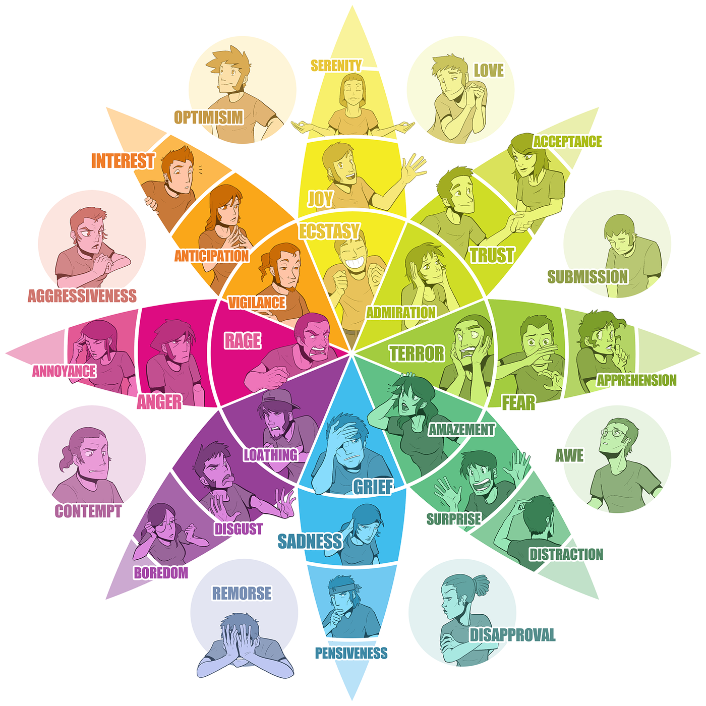

# Emotional Dyads



<figure><figcaption>
<strong>Primary Emotions:</strong> Joy, Trust, Fear, Surprise, Sadness, Disgust, Anger, and Anticipation
</figcaption></figure>




<figure><figcaption></figcaption></figure>



